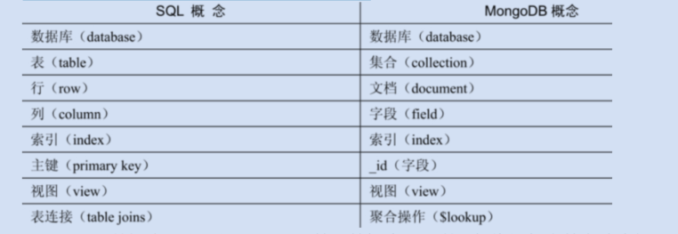

# 入门概述

## 一 背景知识

###### MongoDB是什么

* MongoDB是一个文档数据库（以JSON为数据模型），由C++语言编写，旨在为WEB应用提供可扩展的高性能数据存储解决方案
* MongoDB是一个介于关系数据库和非关系数据库之间的产品，是非关系数据库当中功能最丰富，最像关系数据库的
* 数据格式是BSON，一种类似JSON的二进制形式的存储格式,可以存储比较复杂的数据类型

###### MongoDB有哪些优势

* 表结构不固定,便于拓展,快速响应业务变化,快速迭代开发
* 高并发,高可用(分片,复制集)
* 支持的数据类型更多,查询功能更强大

###### MongoDB概念对比



###### BSON和JSON的区别


## 二 数据类型


## 三 最佳实践


# 基础语法


## 一 CRUD

## 二 权限

## 三 索引

## 四 事务


# 开发实践

## 一 依赖配置

```yaml

```

### 单数据源

### 多数据源

### 集群


## 二 常用注解


## 三 MongoTemplate

## 四 事务


# 高级拓展

## 一 复制集


## 二 分片集群


## 三 WireTiger存储引擎


## 四 监控管理


